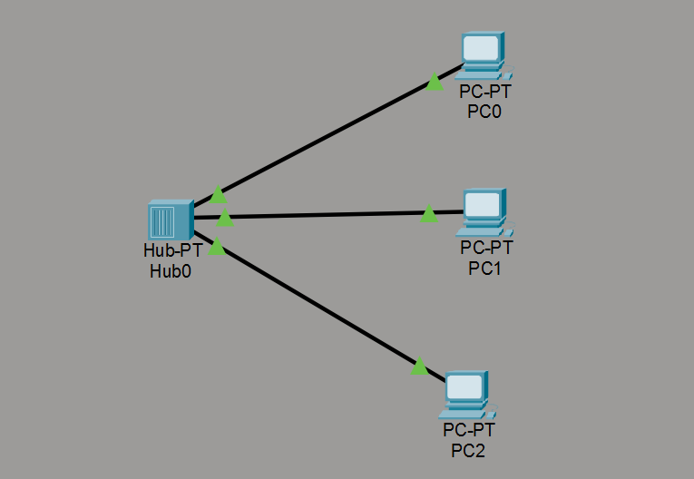
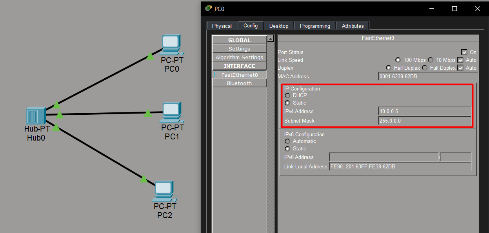
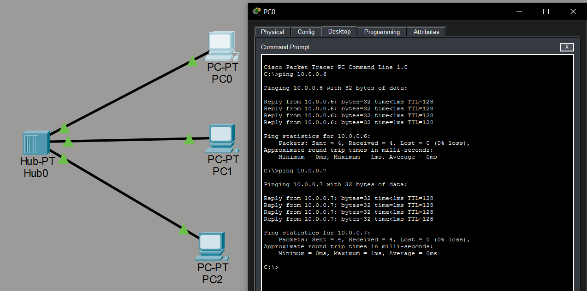
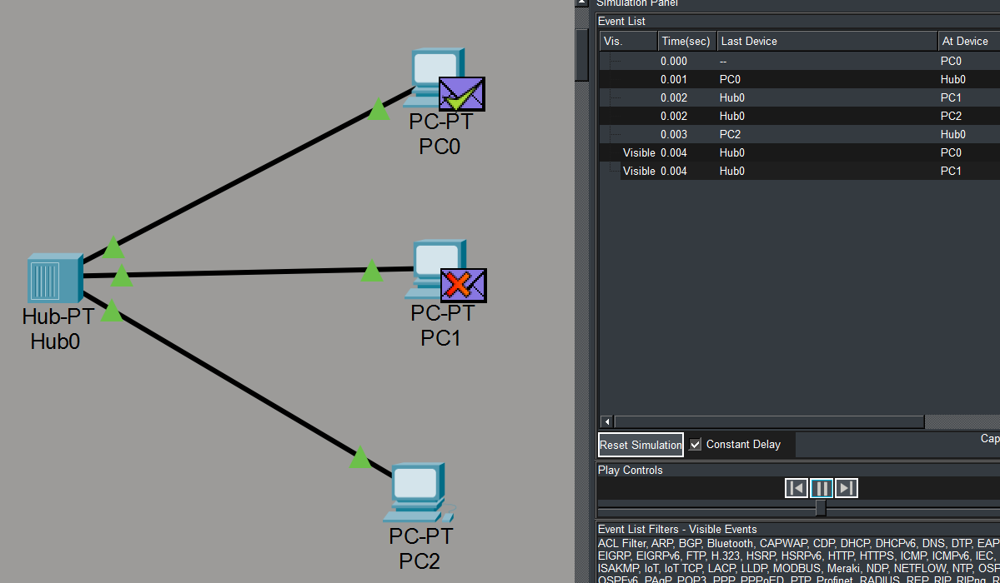
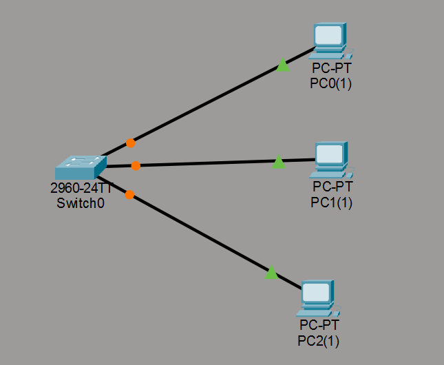
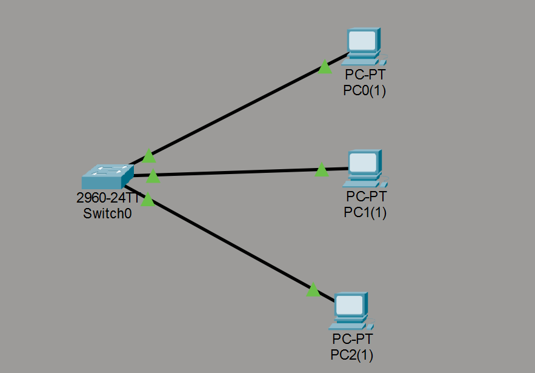
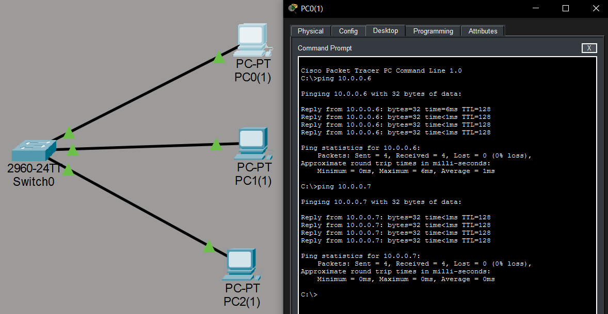
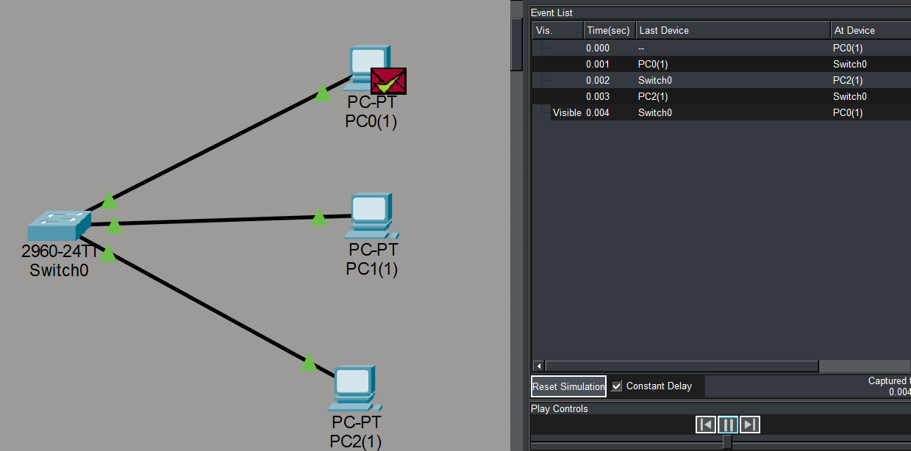

## Video

https://github.com/user-attachments/assets/ae420a8e-9a79-439f-93fd-5b256ea22bf7

## Relatorio Tecnico Cisco Packet Tracer

### 1) Cenario 1 - Rede com HUB (meio compartilhado)

#### 1.1 Topologia e endereçamento

- Dispositivos: 3 PCs (PC0, PC1, PC2) e 1 HUB
- Cabeamento: par trançado (copper)
- Endereços IP:

  - PC0: 10.0.0.5 / 255.0.0.0
  - PC1: 10.0.0.6 / 255.0.0.0
  - PC2: 10.0.0.7 / 255.0.0.0

**[Print 1 - Topologia com HUB + cabos]**

**[Print 2 - Configuração de IPs nos PCs]**

#### 1.2 Teste de conectividade (ping)

Foi realizados pings entre todos os pares de PCs para validar comunicação no mesmo segmento de rede.

**[Print 3 - Pings entre os PCs (ex.: PC0 -> PC1 e PC0 -> PC2)]**

#### 1.3 Simple PDU (PC0 -> PC2) e observação da simulação

Ao enviar uma Simple PDU do PC0 para o PC2 em modo Simulation, foi possível observar a propagação do tráfego pelo HUB.

**[Print 4 - Simulação da Simple PDU (Event List / caminho do pacote) - HUB]**

#### 1.4 Explicações técnicas (HUB)

**A) Por que todos os nós recebem o quadro inicialmente dentro de um hub?:**
O hub atua na camada física (Camada 1). Ele não interpreta quadros Ethernet, não lê endereços MAC e não decide para onde encaminhar com base em destino. O comportamento dele é o de um repetidor multiporta: qualquer sinal que entra por uma porta é regenerado e enviado para todas as demais portas. Por isso, todos os PCs conectados recebem o quadro “fisicamente” no início, mesmo que apenas o destinatário correto processe e aceite o tráfego depois.

**B) Como isso se relaciona ao conceito de meio compartilhado com desempenho real na camada física?:**
Em uma rede com hub, todos os dispositivos dividem o mesmo meio lógico de transmissão. Isso significa que a banda é compartilhada e o tráfego de um nó “aparece” para os demais. Como todos competem pelo mesmo meio, transmissões simultâneas podem gerar colisões e exigir retransmissões, o que reduz o desempenho real percebido. Na prática, quanto mais dispositivos ativos, maior a contenção do meio e menor o aproveitamento efetivo da largura de banda.

---

### 2) Cenário 2 - Rede com SWITCH 2960 (comparação física)

#### 2.1 Topologia e endereçamento

- Dispositivos: 3 PCs (PC0, PC1, PC2) e 1 Switch 2960
- Mesmos IPs e mesma organização física de conexões do cenário anterior (apenas substituição do hub pelo switch).

**[PRINT 5 - Topologia com SWITCH 2960 + cabos]**

#### 2.2 Estabilização das portas

Após ligar e conectar, aguarda a estabilização das portas para iniciar os testes.

**[PRINT 6 - Portas estabilizadas / links ativos no switch]**

#### 2.3 Teste de conectividade (ping)

Foram repetidos os pings entre todos os PCs, confirmando conectividade.

**[PRINT 7 - Pings entre os PCs - SWITCH]**

#### 2.4 Simple PDU (PC0 -> PC2) e observação da simulação

A Simple PDU foi reenviada do PC0 para o PC2 em modo Simulation para comparar o comportamento.

**[PRINT 8 - Simulação da Simple PDU (Event List / caminho do pacote) - SWITCH]**

#### 2.5 Explicações técnicas (SWITCH)

**A) Compare o fluxo do sinal elétrico no switch versus hub:**
No hub, o sinal recebido é repetido para todas as portas, sem qualquer filtragem. Com o switch, o dispositivo recebe o quadro em uma porta e faz o encaminhamento com base no endereço MAC de destino. Isso faz que em tráfego unicast, o quadro seja enviado apenas para a porta onde está o destino, em vez de ser replicado para todos.

**B) Por que agora a PDU não é propagada para todos os nós da mesma forma?:**
Porque o switch opera na camada de enlace (Camada 2) e mantém uma tabela de endereços MAC associando cada MAC à cada porta conectada. Quando o destino já é conhecido, o switch encaminha o quadro diretamente para a porta correta. Assim, os outros nós não recebem o mesmo quadro unicast como acontecia no hub. (tráfegos de broadcast, como ARP, ainda podem ser enviados para múltiplas portas dentro da VLAN.)

**C) O switch elimina o meio físico compartilhado? Justifique tecnicamente:**
O switch não elimina o meio físico (os cabos continuam existindo), mas elimina o compartilhamento típico do hub no sentido de colisões e contenção do mesmo domínio físico. Cada porta do switch passa a ser um domínio de colisão separado, permitindo comunicações simultâneas em portas diferentes sem colisões entre si. Ainda assim, broadcasts continuam existindo dentro da mesma VLAN, então nem todo tráfego é “isolado”; o que muda é que o unicast passa a ser direcionado de forma seletiva.

---

### 3) Comparação entre os cenários (HUB x SWITCH)

**[PRINT 9 - Comparação visual: evento no HUB vs evento no SWITCH (lado a lado, se possível)]**
(cole aqui)

**Comportamento observado na simulação**

- **HUB:** o tráfego enviado por um PC é propagado para todas as portas, então todos os nós recebem o quadro inicialmente. Isso evidencia um meio compartilhado e maior chance de contenção/colisão conforme aumenta o uso.
- **SWITCH:** o tráfego unicast tende a seguir apenas para a porta do destino, pois o switch encaminha com base em MAC. Isso reduz a propagação desnecessária e separa domínios de colisão por porta.

**Impacto prático**

- No **hub**, a rede tende a perder desempenho real com mais transmissões simultâneas porque todos compartilham o mesmo “meio” lógico.
- No **switch**, a rede se comporta de forma mais eficiente para unicast, permitindo múltiplas comunicações ao mesmo tempo em portas diferentes, mantendo o broadcast apenas quando necessário.
